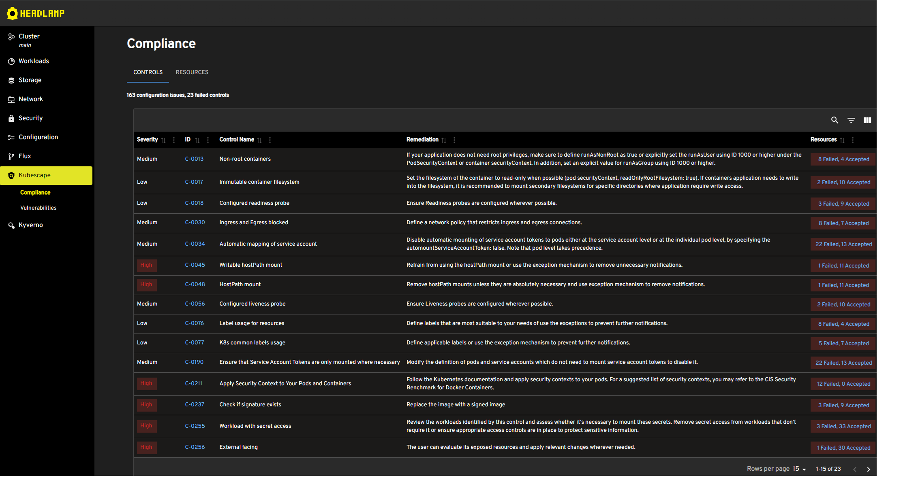
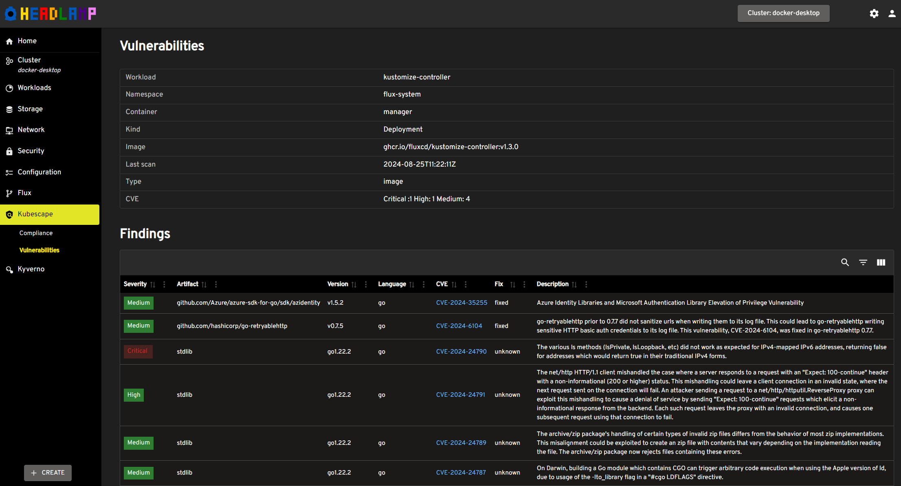

# Kubescape Headlamp Plugin

The Kubescape Headlamp plugin provides an open source plugin for Headlamp. It builds upon the work of [Kubescape](https://kubescape.io/) and [Headlamp](https://github.com/headlamp-k8s/headlamp).

Headlamp is a dashboard for Kubernetes, and is extensible with plugins. Kubescape is a security platform protecting against configuration issues and image vulnerabilities.

The Kubescape Headlamp plugin provides views in Headlamp for configuration and vulnerabilities scanning, based on information delivered by the Kubescape operator.

## Demo





## Prerequisites

- [Kubescape operator](https://kubescape.io/docs/operator/) should be installed in the k8s cluster and enabled for configuration and image scanning.
  We recommend Kubescape operator helm chart v1.22.0 or later with `capabilities.continuousScan: enable`.

  If the operator is working, custom resources are generated. You can test this with e.g. `kubectl get workloadconfigurationscans -A`.

- [Headlamp](https://github.com/headlamp-k8s/headlamp) should be installed in the k8s cluster or workstation. For a quick test the desktop version is recommended.

The plugin has been tested with current versions of Headlamp (browser and desktop) and Kubescape operator.

## Functionality

- Compliancy overview page with views on controls, resources and namespaces.
- Vulnerabilities overview with views on CVEs, resources and images.
- Generated Network policies viewer.
- Playground for Validation Admission Policies.
- eBPF-based runtime threat detection

The queries to the Kubescape database use Headlamps feature for `Allowed namespaces`, supporting multi tenant clusters. Configuration of this setting is done per user in Settings/Cluster.

## Installation

#### Desktop Headlamp

- Install Headlamp (https://headlamp.dev/docs/latest/installation/desktop/)
- Open Plugin Catalog
- Turn off "Only Official" (Kubescape plugin has status Verified, not yet Official)
- Select the KubeScape Headlamp plugin and click the install button
- After install you may need to restart Headlamp

#### In-cluster Headlamp

- Install Headlamp (https://headlamp.dev/docs/latest/installation/in-cluster/)
- Add an initContainer to the headlamp deployment to download the kubescape-plugin files. See [example helm values](https://github.com/kubebeam/kubescape-headlamp-plugin/blob/main/examples/headlamp-helm-values.yaml).

## Quick test

You can perform a quick test using a kind cluster.

### Create kind cluster

Install [kind](https://kind.sigs.k8s.io/docs/user/quick-start/) and create a new kind cluster.

### Install Kubescape operator

Install kubescape with helm:

```
helm repo add kubescape https://kubescape.github.io/helm-charts/
helm upgrade --install kubescape kubescape/kubescape-operator -n kubescape --create-namespace --set capabilities.runtimeDetection=enable --set alertCRD.installDefault=true --set nodeAgent.config.maxLearningPeriod=10m --set capabilities.continuousScan=enable
```

Note we set a short learning period. For a thorough training 24 hours would be recommended.

Wait a few moments for Kubescape to install. Check `kubectl get pods -n kubescape`.

### Test deployments

Install test deployments.

- Nginx `kubectl apply -f https://k8s.io/examples/application/deployment.yaml -n default`
- Emojivoto `kubectl apply -k github.com/BuoyantIO/emojivoto/kustomize/deployment`

### Headlamp desktop

Start headlamp desktop, load the kubeconfig from the kind cluster. For the runtime scanning you need to wait 10 minutes, the learning period.

## Docs

[Notes](./docs/kubescape-model.md) about the Kubescape datamodel and how we leverage it for the plugin.

## Dependencies

- The plugin depends on documentation of configuration scanning in [Kubescape User Hub](https://hub.armosec.io/docs/controls).
- The plugin depends on JSON documentation in the [kubescape regolibrary](https://github.com/kubescape/regolibrary/releases/download/v2/controls/). The [control libary](./src/ConfigurationScanning/controlLibrary.js) is copied for use in the plugin code.

## Contributing and Feedback

For any questions or feedback, please open an issue on the GitHub repository.

Contributions are welcome! Please fork the repository and submit a pull request.

## License

This project is licensed under the Apache-2.0 License. See the LICENSE file for details.
