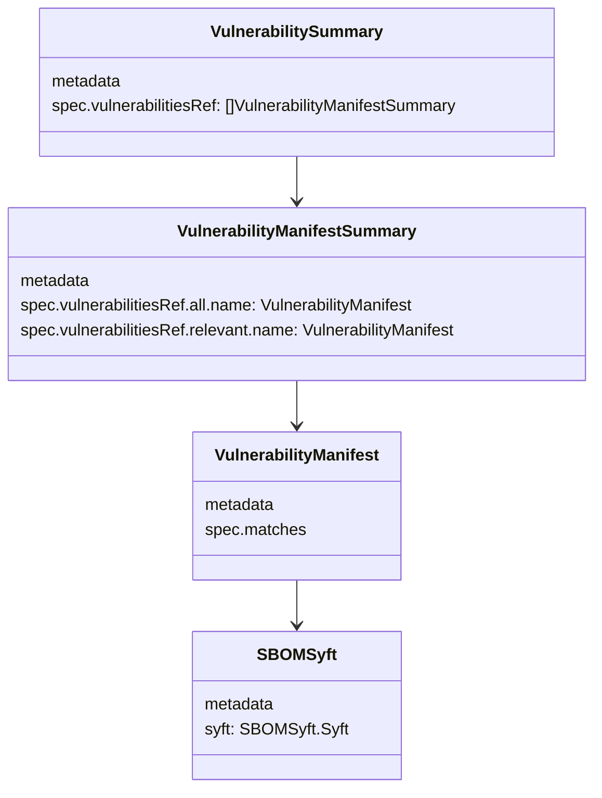
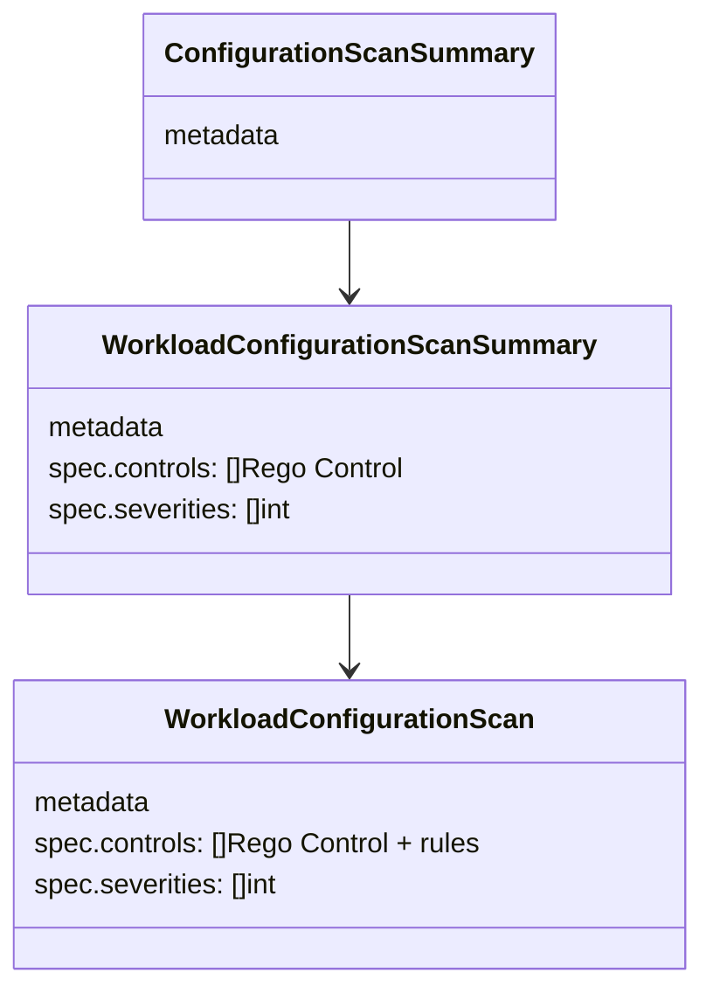

## Kubescape datamodel

Kubescape provides several reporting objects that can be retrieved via the K8s API server.

### Image Scanning

### Configuration Scanning

### Information Flow

Users have different information needs, dependening on their role and task.

| User Flow                                                                   | Model                                                               | Notes |
| --------------------------------------------------------------------------- | ------------------------------------------------------------------- | ----- |
| User views deployment in Headlamp and wants to check for vulnerabilities    | Deployment -> VulnerabilityManifestSummary -> VulnerabilityManifest |       |
| User views resource in Headlamp and wants to check for configuration issues | Resource -> WorkloadConfigurationScan                               |       |
| User views an overview of configuration issues in the cluster               | List WorkloadConfigurationScan -> WorkloadConfigurationScan[]       |       |
| User views an overview of vulnerabilities in K8s Cluster                    | List VulnerabilityManifestSummaries                                 |       |
| User navigates from cluster vulnerabilities overview to details             | VulnerabilityManifestSummary -> VulnerabilityManifest               |       |

### Notes

- Kubescape uses API aggregation: https://github.com/kubescape/storage. There are no CRDs. The API contract can be found in the softwarecomposition [folder](https://github.com/kubescape/storage/tree/main/pkg/apis/softwarecomposition/v1beta1).

- The list queries do not provide details but only metadata. This makes it challenging for the GUI. As a workaround the plugin makes multiple calls to individual resources.

- ConfigurationScanSummary and VulnerabilitySummary are returned by Kubescape without UID in the metadata. This makes it harder to retrieve these objects with the HeadLamp api proxy, because the retrieved list is put in a map by UID. As a workaround we use ApiProxy.request() instead of useApiList().

- Overview page for ConfigurationScan (Compliance) makes a lot of K8s calls, the list queries cannot be used. This might become an issue for big clusters.
